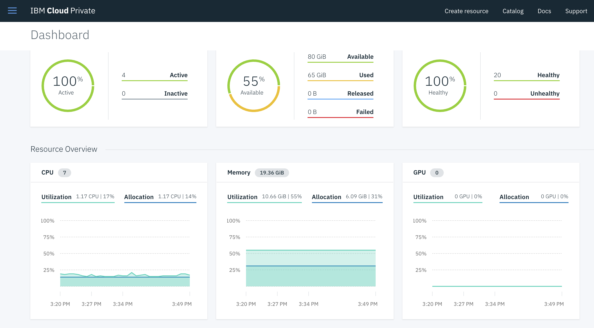
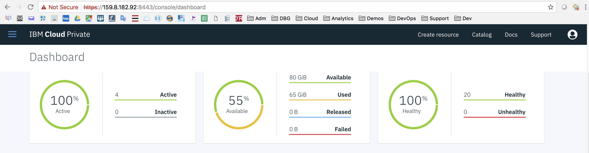

<div style="background-color:black;color:white; vertical-align: middle; text-align:center;font-size:250%; padding:10px; margin-top:100px"><b>
IBM Cloud Private - Multi-Node Cluster Installation Lab
 </b></a></div>

---



# Multi-Node Cluster Installation Lab

The purpose of this lab is to install a complete IBM Cloud Private cluster running on multiple nodes.

> **Prerequisites** : you should have defined 4 (virtual) machines (Ubuntu 16.04) and collected IP addresses and root passwords for these 4 machines.


### Table of Contents

---
- [Task 1: Prerequisites](#task-1--prerequisites)
- [Task 2: Step by step configuration](#task-2--step-by-step-configuration)
    + [Step 1: Login to the master machine](#step-1--login-to-the-master-machine)
    + [Step 2: Setup the credentials for all machines](#step-2--setup-the-credentials-for-all-machines)
    + [Step 3: Install Docker on the master node](#step-3--install-docker-on-the-master-node)
    + [Step 4: Download ICP installation code](#step-4--download-icp-installation-code)
    + [Step 5: Create ssh keys](#step-5--create-ssh-keys)
    + [Step 6: Distribute ssh keys on the other nodes](#step-6--distribute-ssh-keys-on-the-other-nodes)
    + [Step 7: Install Docker engine on all nodes](#step-7--install-docker-engine-on-all-nodes)
- [Task 3: IBM Cloud Private Installation](#task-3--ibm-cloud-private-installation)
- [Task 4: Command Line installations](#task-4--command-line-installations)
- [Task 5: Check your ICP console](#task-5--check-your-icp-console)
- [Congratulations](#congratulations)
- [Appendix: All in One Script for the installation](#appendix--all-in-one-script-for-the-installation)
---
 
 
# Task 1: Prerequisites

Before you start installing IBM Cloud Private, you must provision a set of four machines :
- one master node: 4 vcores, 8 GB (RAM), 100 GB (Storage), public IP
- one proxy node: 1 vcore, 4 GB (RAM), 100 GB (Storage), public IP
- Two worker nodes: 1 vcore, 4 GB (RAM), 100 GB (Storage), public IP
- All nodes are running Ubuntu 16.04 LTS
- ICP Community Edition - version 2.1.0.3

Let's say that we have a **prefix hostname** (**nicex** in my example). Then each node will get a complementary character or string at the end :
- m : example - nicexm for the master node
- w1 or w2 : example - nicexw1 and nicexw2 for the worker nodes
- p: example - nicexp for the proxy node

Then you need to get all IPs and root passwords in a list like the one below:

```console
MASTERIP=159.8.182.92
PASSM=Ejdqs2Jq
PROXYIP=159.8.182.80
PASSP=MGYwjzA8
WORKER1IP=169.50.200.68
PASSW1=QflcDmG6
WORKER2IP=159.8.182.89
PASSW2=FFp9lf7R
PREFIX=nicex 
```

All machines should be **up** and **running**. They also must be **accessible** to each other. 

# Task 2: Step by step configuration

### Step 1: Login to the master machine

You must ssh or putty to the **master node**:

`ssh root@masterip`

You are going to stay on the Master node during all the exercise.

### Step 2: Setup the credentials for all machines

Prepare the following set of commands to set variables:
```console 
MASTERIP=masterip
PASSM=passm
PROXYIP=proxyip
PASSP=passp
WORKER1IP=worker2ip
PASSW1=passw1
WORKER2IP=worker2ip
PASSW2=passw2
PREFIX=nicex
````
> **IMPORTANT** : Once prepared, copy and paste all these commands in the Ubuntu Shell so that all **variables are set**. All these variables will be used during most of the commands in this lab. **Double check** passwords and IPs. 

Then execute the following commands to create a credentials file (this file will be used to setup keys and install Docker remotely in the next tasks):
```console 
cd /root/.ssh
cat <<END > credentials
root:$PASSM@$MASTERIP
root:$PASSP@$PROXYIP
root:$PASSW1@$WORKER1IP
root:$PASSW2@$WORKER2IP
END
```
> Note that in this lab, all machines will be accessed using the super user **root**.

We now need to create an **/etc/hosts** file for all nodes. Execute the following commands:

```console 
echo "127.0.0.1 localhost" > /etc/hosts
echo "$MASTERIP ${PREFIX}m.ibm.ws ${PREFIX}m" >> /etc/hosts
echo "$PROXYIP ${PREFIX}p.ibm.ws ${PREFIX}p" >> /etc/hosts
echo "$WORKER1IP ${PREFIX}w1.ibm.ws ${PREFIX}w1" >> /etc/hosts
echo "$WORKER2IP ${PREFIX}w2.ibm.ws ${PREFIX}w2" >> /etc/hosts
```
> Note : the dns suffix name used here is ibm.ws could be change to match your own specific requirements

### Step 3: Install Docker on the master node

First, you need to create a file that will be used to install Docker on the master and all the other  nodes. 

To do so execute the following command:
```console
cat << 'END' > dockerinstall.sh
apt-get -q update
apt-get -y install apt-transport-https ca-certificates curl software-properties-common 
sysctl -w vm.max_map_count=262144
curl -fsSL https://download.docker.com/linux/ubuntu/gpg | apt-key add -
add-apt-repository "deb [arch=amd64] https://download.docker.com/linux/ubuntu $(lsb_release -cs) stable"
apt-get -q update
apt-get -y install sshpass python-minimal jq
apt-cache madison docker-ce
apt-get -y install docker-ce=17.12.1~ce-0~ubuntu
docker version
END
```

Then you can execute this script to install docker:
```console
chmod +x dockerinstall.sh
./dockerinstall.sh
```

This command should end with the following results:
```console 
Client:
 Version:	17.12.1-ce
 API version:	1.35
 Go version:	go1.9.4
 Git commit:	7390fc6
 Built:	Tue Feb 27 22:17:40 2018
 OS/Arch:	linux/amd64

Server:
 Engine:
  Version:	17.12.1-ce
  API version:	1.35 (minimum version 1.12)
  Go version:	go1.9.4
  Git commit:	7390fc6
  Built:	Tue Feb 27 22:16:13 2018
  OS/Arch:	linux/amd64
  Experimental:	false

```

### Step 4: Download ICP installation code

We pull the ICP Community Edition from the Docker Hub web site. 

Execute the following command:
```console
docker pull ibmcom/icp-inception:2.1.0.3
```

### Step 5: Create ssh keys

On the master, we need to generate ssh keys that will copied across the cluster for secure communications. 

Execute the following commands:
```console 
mkdir /opt/icp
cd /opt/icp
docker run -e LICENSE=accept -v "$(pwd)":/data ibmcom/icp-inception:2.1.0.3 cp -r cluster /data
ssh-keygen -b 4096 -f ~/.ssh/id_rsa -N ""
cat ~/.ssh/id_rsa.pub | tee -a ~/.ssh/authorized_keys
systemctl restart sshd
cp ~/.ssh/id_rsa /opt/icp/cluster/ssh_key

```

> The result : id_rsa key is copied in the cluster directory.

### Step 6: Distribute ssh keys on the other nodes

Execute the 2 commands to **distribute** the keys and restart **sshd** on all nodes (these commands use sshpass that will transfer the pasword when requested):

```console
cd /root/.ssh

tr ':@' '\n' < credentials | xargs -L3 sh -c 'sshpass -p $1 ssh-copy-id -o StrictHostKeyChecking=no -f $0@$2'
tr ':@' '\n' < credentials | xargs -L3 sh -c 'ssh -o StrictHostKeyChecking=no $0@$2 systemctl restart sshd'
```

### Step 7: Install Docker engine on all nodes

Execute the 3 commands to copy remotely /etc/hosts, dockerinstall.sh and install Docker engine on all nodes with the dockerinstall.sh script:

```console
tr ':@' '\n' < credentials | xargs -L3 sh -c 'scp -o StrictHostKeyChecking=no /etc/hosts $0@$2:/etc/hosts'
tr ':@' '\n' < credentials | xargs -L3 sh -c 'scp -o StrictHostKeyChecking=no /root/.ssh/dockerinstall.sh $0@$2:/root/.ssh/dockerinstall.sh'
tr ':@' '\n' < credentials | xargs -L3 sh -c 'ssh -o StrictHostKeyChecking=no $0@$2 ./.ssh/dockerinstall.sh'
```

# Task 3: IBM Cloud Private Installation

Execute this first command to define the ICP topology (one master, 2 workers and one proxy). The management is hosted in the master node:

```console 
cat <<END > /opt/icp/cluster/hosts
[master]
$MASTERIP

[worker]
$WORKER1IP
$WORKER2IP

[proxy]
$PROXYIP

[management]
$MASTERIP
END
```

Then type the following command to install ICP on the 4 nodes:

```console
docker run -e LICENSE=accept --net=host -t -v "$(pwd)":/installer/cluster ibmcom/icp-inception:2.1.0.3 install
```
> Note : the installation should take 30 minutes. So, if you don't see any error during the first 5 minutes, take a coffee. 

> Note : in case of error, you can retry the installation command or you can use the uninstall process :
```console 
docker run -e LICENSE=accept --net=host -t -v "$(pwd)":/installer/cluster ibmcom/icp-inception:2.1.0.3 uninstall
```

# Task 4: Command Line installations

**kubectl** installation, type the following command:

 ```console 
 docker run -e LICENSE=accept --net=host -v /usr/local/bin:/data ibmcom/icp-inception:2.1.0.3 cp /usr/local/bin/kubectl /data
 ```
 
 **Connection** to the master node script, type the following commands:
 
 ```console 
 cd /root

cat << 'EOF' > connect2icp.sh
CLUSTERNAME=mycluster
ACCESS_IP=`curl ifconfig.co`
USERNAME=admin
PASSWD=admin
token=$(curl -s -k -H "Content-Type: application/x-www-form-urlencoded;charset=UTF-8" -d "grant_type=password&username=$USERNAME&password=$PASSWD&scope=openid" https://$ACCESS_IP:8443/idprovider/v1/auth/identitytoken --insecure | jq .id_token | awk  -F '"' '{print $2}')
kubectl config set-cluster $CLUSTERNAME.icp --server=https://$ACCESS_IP:8001 --insecure-skip-tls-verify=true
kubectl config set-context $CLUSTERNAME.icp-context --cluster=$CLUSTERNAME.icp
kubectl config set-credentials admin --token=$token
kubectl config set-context $CLUSTERNAME.icp-context --user=admin --namespace=default
kubectl config use-context $CLUSTERNAME.icp-context
EOF

chmod +x connect2icp.sh
./connect2icp.sh
 ```

**ibmcloud** CLI installation, , type the following commands:

```console 
curl -fsSL https://clis.ng.bluemix.net/install/linux | sh
wget https://mycluster.icp:8443/api/cli/icp-linux-amd64 --no-check-certificate
ibmcloud plugin install icp-linux-amd64
ibmcloud plugin install dev -r Bluemix
```

**Persistent volumes**, type the following commands:
```console
cd /tmp
mkdir data01

cat <<EOF | kubectl create -f -
apiVersion: v1
kind: PersistentVolume
metadata:
  name: hostpath-pv-once-test1
spec:
  accessModes:
  - ReadWriteOnce
  capacity:
    storage: 30Gi
  hostPath:
    path: /tmp/data01
  persistentVolumeReclaimPolicy: Recycle
EOF

cat <<EOF | kubectl create -f -
apiVersion: v1
kind: PersistentVolume
metadata:
  name: hostpath-pv-many-test1
spec:
  accessModes:
  - ReadWriteMany
  capacity:
    storage: 50Gi
  hostPath:
    path: /tmp/data01
  persistentVolumeReclaimPolicy: Recycle
EOF

cd /root
```

# Task 5: Check your ICP console

Type the following URL in your browser:
 
`https://masterip:8443`

Go to the **menu** (top left), click on **Dashboard**



Check the number of nodes (4), the 55% of available storage and the 20 healthy pods.


# Congratulations 

You have successfully installed, deployed and customized the Kubernetes Cluster for an **IBM Cloud Private**. 

# Appendix: All in One Script for the installation

Find below one script file for the automated installation (All in one script) :

```console
#!/bin/bash

# This script must run on the Ubuntu Master node
# Variables to be set before execution

MASTERIP=
PASSM=
PROXYIP=
PASSP=
WORKER1IP=
PASSW1=
WORKER2IP=
PASSW2=
PREFIX=

# Don't change anything below this line
# Create Credentials file

cd /root/.ssh
cat <<END > credentials
root:$PASSM@$MASTERIP
root:$PASSP@$PROXYIP
root:$PASSW1@$WORKER1IP
root:$PASSW2@$WORKER2IP
END

# Create Hosts file

echo "127.0.0.1 localhost" > /etc/hosts
echo "$MASTERIP ${PREFIX}m.ibm.ws ${PREFIX}m" >> /etc/hosts
echo "$PROXYIP ${PREFIX}p.ibm.ws ${PREFIX}p" >> /etc/hosts
echo "$WORKER1IP ${PREFIX}w1.ibm.ws ${PREFIX}w1" >> /etc/hosts
echo "$WORKER2IP ${PREFIX}w2.ibm.ws ${PREFIX}w2" >> /etc/hosts

# Install Docker on the master

cat << 'END' > dockerinstall.sh
apt-get -q update
apt-get -y install apt-transport-https ca-certificates curl software-properties-common 
sysctl -w vm.max_map_count=262144
curl -fsSL https://download.docker.com/linux/ubuntu/gpg | apt-key add -
add-apt-repository "deb [arch=amd64] https://download.docker.com/linux/ubuntu $(lsb_release -cs) stable"
apt-get -q update
apt-get -y install sshpass python-minimal jq
apt-cache madison docker-ce
apt-get -y install docker-ce=17.12.1~ce-0~ubuntu
docker version
END

chmod +x dockerinstall.sh
./dockerinstall.sh

# Download inception

docker pull ibmcom/icp-inception:2.1.0.3

# Create ssh Keys

mkdir /opt/icp
cd /opt/icp
docker run -e LICENSE=accept -v "$(pwd)":/data ibmcom/icp-inception:2.1.0.3 cp -r cluster /data
ssh-keygen -b 4096 -f ~/.ssh/id_rsa -N ""
cat ~/.ssh/id_rsa.pub | tee -a ~/.ssh/authorized_keys
systemctl restart sshd
cp ~/.ssh/id_rsa /opt/icp/cluster/ssh_key

# From the boot/master - Install Hosts, Docker, restart SSH and copy keys on each NODE
cd /root/.ssh

tr ':@' '\n' < credentials | xargs -L3 sh -c 'sshpass -p $1 ssh-copy-id -o StrictHostKeyChecking=no -f $0@$2'
tr ':@' '\n' < credentials | xargs -L3 sh -c 'ssh -o StrictHostKeyChecking=no $0@$2 systemctl restart sshd'
tr ':@' '\n' < credentials | xargs -L3 sh -c 'scp -o StrictHostKeyChecking=no /etc/hosts $0@$2:/etc/hosts'
tr ':@' '\n' < credentials | xargs -L3 sh -c 'scp -o StrictHostKeyChecking=no /root/.ssh/dockerinstall.sh $0@$2:/root/.ssh/dockerinstall.sh'
tr ':@' '\n' < credentials | xargs -L3 sh -c 'ssh -o StrictHostKeyChecking=no $0@$2 ./.ssh/dockerinstall.sh'


# Customize hosts

cat <<END > /opt/icp/cluster/hosts
[master]
$MASTERIP

[worker]
$WORKER1IP
$WORKER2IP

[proxy]
$PROXYIP

[management]
$MASTERIP
END


# ICP Installation

cd /opt/icp/cluster
docker run -e LICENSE=accept --net=host -t -v "$(pwd)":/installer/cluster ibmcom/icp-inception:2.1.0.3 install
docker run -e LICENSE=accept --net=host -v /usr/local/bin:/data ibmcom/icp-inception:2.1.0.3 cp /usr/local/bin/kubectl /data

# Connection to ICP on the master

cd /root
cat << 'EOF' > connect2icp.sh
CLUSTERNAME=mycluster
ACCESS_IP=`curl ifconfig.co`
USERNAME=admin
PASSWD=admin
token=$(curl -s -k -H "Content-Type: application/x-www-form-urlencoded;charset=UTF-8" -d "grant_type=password&username=$USERNAME&password=$PASSWD&scope=openid" https://$ACCESS_IP:8443/idprovider/v1/auth/identitytoken --insecure | jq .id_token | awk  -F '"' '{print $2}')
kubectl config set-cluster $CLUSTERNAME.icp --server=https://$ACCESS_IP:8001 --insecure-skip-tls-verify=true
kubectl config set-context $CLUSTERNAME.icp-context --cluster=$CLUSTERNAME.icp
kubectl config set-credentials admin --token=$token
kubectl config set-context $CLUSTERNAME.icp-context --user=admin --namespace=default
kubectl config use-context $CLUSTERNAME.icp-context
EOF

chmod +x connect2icp.sh
./connect2icp.sh

# CLI installation

curl -fsSL https://clis.ng.bluemix.net/install/linux | sh
wget https://mycluster.icp:8443/api/cli/icp-linux-amd64 --no-check-certificate
ibmcloud plugin install icp-linux-amd64
ibmcloud plugin install dev -r Bluemix


# Persistent Volumes

cd /tmp
mkdir data01

cat <<EOF | kubectl create -f -
apiVersion: v1
kind: PersistentVolume
metadata:
  name: hostpath-pv-once-test1
spec:
  accessModes:
  - ReadWriteOnce
  capacity:
    storage: 30Gi
  hostPath:
    path: /tmp/data01
  persistentVolumeReclaimPolicy: Recycle
EOF

cat <<EOF | kubectl create -f -
apiVersion: v1
kind: PersistentVolume
metadata:
  name: hostpath-pv-many-test1
spec:
  accessModes:
  - ReadWriteMany
  capacity:
    storage: 50Gi
  hostPath:
    path: /tmp/data01
  persistentVolumeReclaimPolicy: Recycle
EOF

cd /root
```

----


<div style="background-color:black;color:white; vertical-align: middle; text-align:center;font-size:250%; padding:10px; margin-top:100px"><b>
IBM Cloud Private - IBM Cloud Private MultiNode Installation Lab
 </b></a></div>
