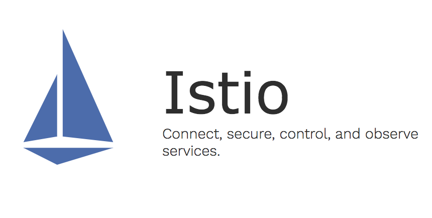
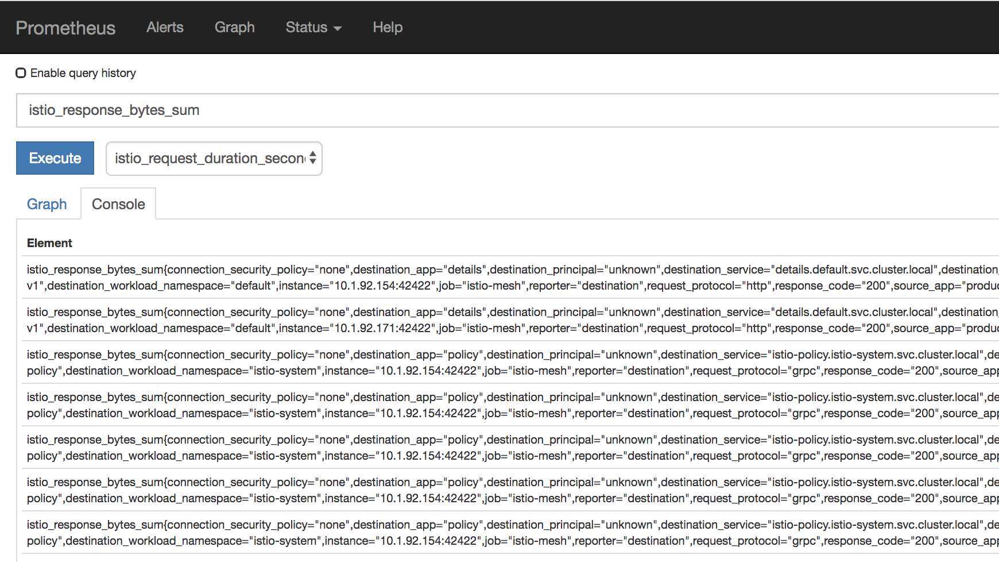

<div style="background-color:black;color:white; vertical-align: middle; text-align:center;font-size:250%; padding:10px; margin-top:100px"><b>
IBM Cloud Private - Istio Lab
 </b></a></div>

---



# Istio Lab

In recent years, with the development of container technology, more enterprise customers are turning to microservices. Microservices are a combination of lightweight and fine-grained services that work cohesively to allow for larger, application-wide functionality. This approach improves modularity and makes applications easier to develop and test when compared to traditional, monolithic application. With the adoption of microservices, new challenges emerge due to a myriad of services that exist in larger systems. Developers must now account for service discovery, load balancing, fault tolerance, dynamic routing, and communication security. Thanks to Istio, we can turn disparate microservices into an integrated service mesh by systemically injecting envoy proxy into the network layers while decoupling the operators to connect, manage, and secure microservices for application feature development.

This lab takes you step-by-step through the installation of Istio and the deployment of microservices-based applications in IBM Cloud Private.

> **Prerequisites** : you should be logged on your VM and connected to your ICP master.


### Table of Contents

---
- [Task1: Installing Istio on IBM Cloud Private](#task1--installing-istio-on-ibm-cloud-private)
- [Task2 - Deploy the Bookinfo application](#task2---deploy-the-bookinfo-application)
    + [Create Secret](#create-secret)
    + [Prepare the Bookinfo manifest](#prepare-the-bookinfo-manifest)
    + [Automatic Sidecar Injection](#automatic-sidecar-injection)
- [Task3: Access the Bookinfo application](#task3--access-the-bookinfo-application)
- [Task4: Collect Metrics with Prometheus](#task4--collect-metrics-with-prometheus)
- [Task5: Visualizing Metrics with Grafana](#task5--visualizing-metrics-with-grafana)
- [Congratulations](#congratulations)

---
 
 

# Task1: Installing Istio on IBM Cloud Private 

In this module, you download and install Istio.

1.  Either download Istio directly from [https://github.com/istio/istio/releases](https://github.com/istio/istio/releases) or get the latest version by using curl:
    
    ```bash
    curl -L https://git.io/getLatestIstio | sh -
    ```
2. Extract the installation files.
3. Add the `istioctl` client to your PATH. The `<version-number>` is in the directory name. For example, run the following command on a MacOS or Linux system:
```
export PATH="$PATH:/root/istio-1.0.1/bin"
```
1. Change the directory to the Istio file location.

```
cd /root/istio-1.0.1/
```


1. Install Istio on the Kubernetes cluster. Istio is deployed in the Kubernetes namespace `istio-system`.

```bash
kubectl apply -f install/kubernetes/istio-demo.yaml
```

6. Ensure that the `istio-*` Kubernetes services are deployed before you continue.
```bash
kubectl get svc -n istio-system
```
```
NAME                       CLUSTER-IP       EXTERNAL-IP   PORT(S)                                                               AGE
grafana                    172.22.xxx.xxx   <none>        3000/TCP                                                              4d
istio-citadel              172.22.xxx.xxx   <none>        8060/TCP,9093/TCP                                                     1m
istio-egressgateway        172.22.xxx.xxx   <none>        80/TCP,443/TCP                                                        1m
istio-ingressgateway       172.22.xxx.xxx   <pending>     80:31380/TCP,443:31390/TCP,31400:31400/TCP                            1m
istio-pilot                172.22.xxx.xxx   <none>        15003/TCP,15005/TCP,15007/TCP,15010/TCP,15011/TCP,8080/TCP,9093/TCP   1m
istio-policy               172.22.xxx.xxx   <none>        9091/TCP,15004/TCP,9093/TCP                                           1m
istio-sidecar-injector     172.22.xxx.xxx   <none>        443/TCP                                                               1m
istio-statsd-prom-bridge   172.22.xxx.xxx   <none>        9102/TCP,9125/UDP                                                     1m
istio-telemetry            172.22.xxx.xxx   <none>        9091/TCP,15004/TCP,9093/TCP,42422/TCP                                 1m
prometheus                 172.22.xxx.xxx   <none>        9090/TCP                                                              1m
servicegraph               172.22.xxx.xxx   <none>        8088/TCP                                                              1m
tracing                    172.22.xxx.xxx   <pending>     80:30132/TCP                                                          1m
zipkin                     172.22.xxx.xxx   <none>        9411/TCP                                                              1m
```
  **Note: the istio-ingressgateway service will be in `pending` state with no external ip. That is normal.**

7. Ensure the corresponding pods `istio-citadel-*`, `istio-ingressgateway-*`, `istio-pilot-*`, and `istio-policy-*` are all in **`Running`** state before you continue.
```
kubectl get pods -n istio-system
```
```
NAME                                        READY     STATUS    RESTARTS   AGE
grafana-cd99bf478-kpwnk                     1/1       Running   0          1m
istio-citadel-ff5696f6f-5pw9p               1/1       Running   0          1m
istio-egressgateway-58d98d898c-d42f4        1/1       Running   0          1m
istio-ingressgateway-6bc7c7c4bc-f78xr       1/1       Running   0          1m
istio-pilot-6c5c6b586c-dv7fs                2/2       Running   0          1m
istio-policy-5c7fbb4b9f-pj6zz               2/2       Running   0          1m
istio-sidecar-injector-dbd67c88d-ds9xn      1/1       Running   0          1m
istio-statsd-prom-bridge-6dbb7dcc7f-9z6h5   1/1       Running   0          1m
istio-telemetry-54b5bf4847-gmgxt            2/2       Running   0          1m
istio-tracing-67dbb5b89f-lwmzf              1/1       Running   0          1m
prometheus-586d95b8d9-hqfn6                 1/1       Running   0          1m
servicegraph-6d86dfc6cb-hprh2               1/1       Running   0          1m
```

Before your continue, make sure all the pods are deployed and **`Running`**. If they're in `pending` state, wait a few minutes to let the deployment finish.

Congratulations! You successfully installed Istio into your cluster.


# Task2 - Deploy the Bookinfo application
If the control plane is deployed successfully, you can then start to deploy your applications that are managed by Istio. I will use the Bookinfo application as an example to illustrate the steps of deploying applications that are managed by Istio.

### Create Secret

If you are using a private registry for the sidecar image, then you need to create a Secret of type docker-registry in the cluster that holds authorization token, and patch it to your application’s ServiceAccount. Use the following 2 commands:

```bash 
kubectl create secret docker-registry private-registry-key \
  --docker-server=mycluster.icp:8500 \
  --docker-username=admin \
  --docker-password=admin \
  --docker-email=null
```

```bash
kubectl patch serviceaccount default -p '{"imagePullSecrets": [{"name": "private-registry-key"}]}'
```

### Prepare the Bookinfo manifest

Return to your directory:

`cd`

Create a new YAML file named **bookinfo.yaml** to save the Bookinfo application manifest.

  ```sh
apiVersion: v1
kind: Service
metadata:
  name: details
  labels:
    app: details
spec:
  ports:
  - port: 9080
    name: http
  selector:
    app: details
---
apiVersion: extensions/v1beta1
kind: Deployment
metadata:
  name: details-v1
spec:
  replicas: 1
  template:
    metadata:
      labels:
        app: details
        version: v1
    spec:
      containers:
      - name: details
        image: morvencao/istio-examples-bookinfo-details-v1:1.5.0
        imagePullPolicy: IfNotPresent
        ports:
        - containerPort: 9080
---
apiVersion: v1
kind: Service
metadata:
  name: ratings
  labels:
    app: ratings
spec:
  ports:
  - port: 9080
    name: http
  selector:
    app: ratings
---
apiVersion: extensions/v1beta1
kind: Deployment
metadata:
  name: ratings-v1
spec:
  replicas: 1
  template:
    metadata:
      labels:
        app: ratings
        version: v1
    spec:
      containers:
      - name: ratings
        image: morvencao/istio-examples-bookinfo-ratings-v1:1.5.0
        imagePullPolicy: IfNotPresent
        ports:
        - containerPort: 9080
---
apiVersion: v1
kind: Service
metadata:
  name: reviews
  labels:
    app: reviews
spec:
  ports:
  - port: 9080
    name: http
  selector:
    app: reviews
---
apiVersion: extensions/v1beta1
kind: Deployment
metadata:
  name: reviews-v1
spec:
  replicas: 1
  template:
    metadata:
      labels:
        app: reviews
        version: v1
    spec:
      containers:
      - name: reviews
        image: morvencao/istio-examples-bookinfo-reviews-v1:1.5.0
        imagePullPolicy: IfNotPresent
        ports:
        - containerPort: 9080
---
apiVersion: extensions/v1beta1
kind: Deployment
metadata:
  name: reviews-v2
spec:
  replicas: 1
  template:
    metadata:
      labels:
        app: reviews
        version: v2
    spec:
      containers:
      - name: reviews
        image: morvencao/istio-examples-bookinfo-reviews-v2:1.5.0
        imagePullPolicy: IfNotPresent
        ports:
        - containerPort: 9080
---
apiVersion: extensions/v1beta1
kind: Deployment
metadata:
  name: reviews-v3
spec:
  replicas: 1
  template:
    metadata:
      labels:
        app: reviews
        version: v3
    spec:
      containers:
      - name: reviews
        image: morvencao/istio-examples-bookinfo-reviews-v3:1.5.0
        imagePullPolicy: IfNotPresent
        ports:
        - containerPort: 9080
---
apiVersion: v1
kind: Service
metadata:
  name: productpage
  labels:
    app: productpage
spec:
  ports:
  - port: 9080
    name: http
  selector:
    app: productpage
---
apiVersion: extensions/v1beta1
kind: Deployment
metadata:
  name: productpage-v1
spec:
  replicas: 1
  template:
    metadata:
      labels:
        app: productpage
        version: v1
    spec:
      containers:
      - name: productpage
        image: morvencao/istio-examples-bookinfo-productpage-v1:1.5.0
        imagePullPolicy: IfNotPresent
        ports:
        - containerPort: 9080
---
apiVersion: extensions/v1beta1
kind: Ingress
metadata:
  name: gateway
  annotations:
    kubernetes.io/ingress.class: "istio"
spec:
  rules:
  - http:
      paths:
      - path: /productpage
        backend:
          serviceName: productpage
          servicePort: 9080
      - path: /login
        backend:
          serviceName: productpage
          servicePort: 9080
      - path: /logout
        backend:
          serviceName: productpage
          servicePort: 9080
      - path: /api/v1/products.*
        backend:
          serviceName: productpage
          servicePort: 9080
---
  ```

### Automatic Sidecar Injection
If you have enabled automatic sidecar injection, the istio-sidecar-injector automatically injects Envoy containers into your application pods that are running in the namespaces, labelled with istio-injection=enabled. For example, let's deploy the Bookinfo application to thedefault namesapce.

`kubectl label namespace default istio-injection=enabled`

The command to inject the sidecar:

`kubectl create -n default -f bookinfo.yaml`

Results:

```console
kubectl create -n default -f bookinfo.yaml
service "details" created
deployment.extensions "details-v1" created
service "ratings" created
deployment.extensions "ratings-v1" created
service "reviews" created
deployment.extensions "reviews-v1" created
deployment.extensions "reviews-v2" created
deployment.extensions "reviews-v3" created
service "productpage" created
deployment.extensions "productpage-v1" created
ingress.extensions "gateway" created
```

To check that the injection was successful, go to ICP console, click on the **Menu>WorkloadDeployments>productpage


# Task3: Access the Bookinfo application

After all pods for the Bookinfo application are in a running state, you can access the Bookinfo **product page**. 

Display the the service:

`kubectl get svc productpage`

Results:

```console
 kubectl get svc productpage
NAME          TYPE        CLUSTER-IP   EXTERNAL-IP   PORT(S)    AGE
productpage   ClusterIP   10.0.0.159   <none>        9080/TCP   38m
```
Take a note of your Cluster-IP and port:

`curl -o /dev/null -s -w "%{http_code}\n" http://<clusterIP>:<port></port>/productpage`

Results:
```console
curl -o /dev/null -s -w "%{http_code}\n" http://10.0.0.159:9080/productpage
200
```
You should get a return code `200`.

Now, use that command to get the URL to gat access to product page:
```bash
export BOOKINFO_URL=$(kubectl get po -l istio=ingressgateway -n istio-system -o 'jsonpath={.items[0].status.hostIP}'):$(kubectl get svc istio-ingressgateway -n istio-system -o 'jsonpath={.spec.ports[0].nodePort}')
```

Results:
```console
echo $BOOKINFO_URL
5.10.96.73:31380
```
Use this URL to test the bookinfo application:

`curl -o /dev/null -s -w "%{http_code}\n" http://${BOOKINFO_URL}/productpage`

You should get a return code `200`.

You can also access the Bookinfo product page from the browser by specifying the address: http://${BOOKINFO_URL}/productpage. Try to refresh the page several times, you will see different versions of reviews **randomly** shown in the product page(red stars, black stars, no stars), because I haven’t created any route rule for the Bookinfo application.


# Task4: Collect Metrics with Prometheus

In this section, you can see how to configure Istio to automatically gather telemetry and create new customized telemetry for services. I will use the Bookinfo application as an example.

Istio can enable Prometheus with a service type of ClusterIP. You can also expose another service of type NodePort and then access Prometheus by running the following command:

`kubectl expose service prometheus --type=NodePort  --name=istio-prometheus-svc --namespace istio-system` 

`export PROMETHEUS_URL=$(kubectl get po -l app=prometheus \
      -n istio-system -o 'jsonpath={.items[0].status.hostIP}'):$(kubectl get svc \
      istio-prometheus-svc -n istio-system -o 'jsonpath={.spec.ports[0].nodePort}')`
      
`echo http://${PROMETHEUS_URL}/`       

Results:
```console
echo http://${PROMETHEUS_URL}/
http://5.10.96.73:31316/
```

Use the ${PROMETHEUS_URL} to get access to prometheus from a browser:

Type `istio_response_bytes_sum` in the first field and click execute button:



Move to the right to see the metrics collected:


If you don't see anything, retry the following command several times:
`curl -o /dev/null -s -w "%{http_code}\n" http://clusterip:9080/productpage` 

# Task5: Visualizing Metrics with Grafana

Now I will setup and use the Istio Dashboard to monitor the service mesh traffic. I will use the Bookinfo application as an example.

Similar to Prometheus, Istio enables Grafana with a service type of ClusterIP. You need to expose another service of type NodePort to access Grafana from the external environment by running the following commands:

`kubectl expose service grafana --type=NodePort --name=istio-grafana-svc --namespace istio-system`

```
export GRAFANA_URL=$(kubectl get po -l app=grafana -n \
      istio-system -o 'jsonpath={.items[0].status.hostIP}'):$(kubectl get svc \
      istio-grafana-svc -n istio-system -o \
      'jsonpath={.spec.ports[0].nodePort}')
```

`echo http://${GRAFANA_URL}/``

Results:
```console
echo http://${GRAFANA_URL}
http://5.10.96.73:30915
```
Access the Grafana web page from your browser http://${GRAFANA_URL}/.

By default, Istio grafana has three built-in dashboards: Istio Dashboard, Mixer Dashboard and Pilot Dashboard. Istio Mesh Dashboard is an overall view for all service traffic including high-level HTTP requests flowing and metrics about each individual service call, while Mixer Dashboard and Pilot Dashboard are mainly resources usage overview.

Click on the top left HOME button and you should see all the built-in dashboards:


The Istio Mesh Dashboard resembles the following screenshot:


      


# Congratulations 

You have successfully installed, deployed and customized the **Istio** for an **IBM Cloud Private** cluster.

In this lab, I have gone through how to enable Istio on IBM Cloud Private 2.1.0.3. I also reviewed how to deploy microservice-based application that are managed and secured by Istio. The lab also covered how to manage, and monitor microservices with Istio addons such as Prometheus and Grafana.

Istio solves the microservices mesh tangle challenge by injecting a transparent envoy proxy as a sidecar container to application pods. Istio can collect fine-grained metrics and dynamically modify the routing flow without interfering with the original application. This provides a uniform way to connect, secure, manage, and monitor microservices.

For more information about Istio, see https://istio.io/docs/.

----


<div style="background-color:black;color:white; vertical-align: middle; text-align:center;font-size:250%; padding:10px; margin-top:100px"><b>
IBM Cloud Private - Istio Lab
 </b></a></div>
