<div style="background-color:black;color:white; vertical-align: middle; text-align:center;font-size:250%; padding:10px; margin-top:100px"><b>
IBM Cloud Private - LDAP Lab
 </b></a></div>

---

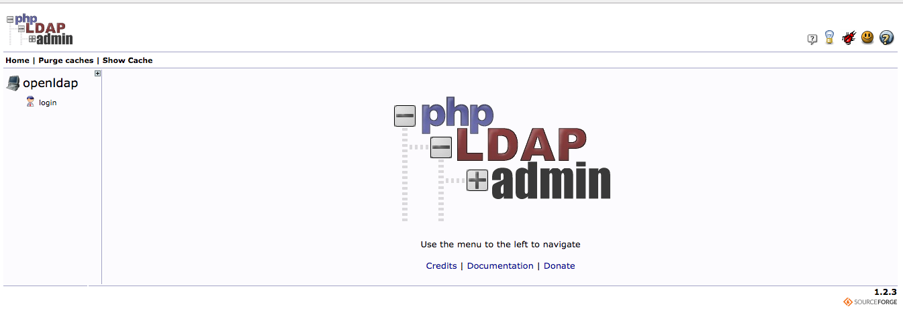


# LDAP Lab

The purpose of this lab is to quickly demonstrate how to install and connect Open LDAP to IBM Cloud private to control access of all the different kinds of administrator. 

We cover 5 steps :
- Check helm
- Installing Open LDAP thru a helm chart in ICP
- Configure and connect the created LDAP to ICP Authentication components
- Create a team with specific user IDs and roles
- Connect with one of the user IDs and test your authorizations


> **Prerequisites** : you should be logged on your VM and connected to your ICP master.


### Table of Contents

---
- [Task 1: Check helm](#task-1--check-helm)
- [Task 2: Install Open LDAP](#task-2--install-open-ldap)
- [Task3: Connect Open LDAP to ICP](#task3--connect-open-ldap-to-icp)
- [Task4: Create a Team](#task4--create-a-team)
- [Task5: Check Roles](#task5--check-roles)
- [Congratulations](#congratulations)
---
 
 
# Task 1: Check helm

We are about to install Open LDAP thru a helm package. 
Before starting this step, we should have a valid helm configuration. 
Here are some steps you need to flow to check helm : 

`helm version --tls`

Results should be :

```console
# helm version --tls
Client: &version.Version{SemVer:"v2.7.3+icp", GitCommit:"27442e4cfd324d8f82f935fe0b7b492994d4c289", GitTreeState:"dirty"}
Server: &version.Version{SemVer:"v2.7.3+icp", GitCommit:"27442e4cfd324d8f82f935fe0b7b492994d4c289", GitTreeState:"dirty"}

```

> **If you get this valid answer, then skip the rest of the section.**

If you get the following answer:
```console
# helm version --tls
helm: command not found
```

Then install helm:

```console
docker run -e LICENSE=accept --net=host -v /usr/local/bin:/data ibmcom/icp-helm-api:1.0.0 cp /usr/src/app/public/cli/linux-amd64/helm /data
```

This command will download the helm file to /usr/local/bin directory.

Set an environment variable:

```console
export HELM_HOME=/root/.helm
```
These 2 commands will first login to ICP cluster and configure your cluster.
cert.pem and key.pem certificates are added to the ~/.helm directory.

```console
ibmcloud pr login -a https://mycluster.icp:8443 --skip-ssl-validation
```

`ibmcloud pr cluster-config mycluster`


 Initialize Helm

`helm init --client-only`

Results:
```console
# helm init --client-only
Creating /root/.helm/repository
Creating /root/.helm/repository/cache
Creating /root/.helm/repository/local
Creating /root/.helm/plugins
Creating /root/.helm/starters
Creating /root/.helm/cache/archive
Creating /root/.helm/repository/repositories.yaml
Adding stable repo with URL: https://kubernetes-charts.storage.googleapis.com
Adding local repo with URL: http://127.0.0.1:8879/charts
$HELM_HOME has been configured at /root/.helm.
Not installing Tiller due to 'client-only' flag having been set
Happy Helming!

```

After you have initialize helm client. Try the following command to see the version:

`helm version --tls`

Results :

```console
# helm version --tls
Client: &version.Version{SemVer:"v2.7.3+icp", GitCommit:"27442e4cfd324d8f82f935fe0b7b492994d4c289", GitTreeState:"dirty"}
Server: &version.Version{SemVer:"v2.7.3+icp", GitCommit:"27442e4cfd324d8f82f935fe0b7b492994d4c289", GitTreeState:"dirty"}

```
> The helm Client and server should be the same version (i.e. version 2.7.3+icp)
 
# Task 2: Install Open LDAP

Get the source code of the helm chart 

```
git clone https://github.com/ibm-cloud-architecture/icp-openldap.git openldap
```
> Note : don't change the name of the directory (openldap) created 

A new directory **openldap** is created.

Package the helm chart using the helm cli:

`helm package openldap`

Results:
```console 
# helm package openldap
Successfully packaged chart and saved it to: /root/openldap-0.1.5.tgz
```

If you have not, log in to your cluster from the IBM Cloud Private CLI and log in to the Docker private image registry. 

`docker login mycluster.icp:8500 -u admin -p admin`

`ibmcloud pr login -a https://mycluster.icp:8443 --skip-ssl-validation`

> Use the admin/admin credentials and choose 1.

Install the Helm chart :

```
ibmcloud pr load-helm-chart --archive /root/openldap-0.1.5.tgz --clustername mycluster.icp 
```

Results:
```console 
# ibmcloud pr load-helm-chart --archive /root/openldap-0.1.5.tgz --clustername mycluster.icp 
Loading helm chart
Loaded helm chart
Synch charts
Synch started
OK
```

We are going to use the **Catalog** on the ICP management Console:

https://icpaddress:8443

Login to the console with admin/admin. Go to the Catalog.
Type **open** in the search zone to retrieve openldap package.

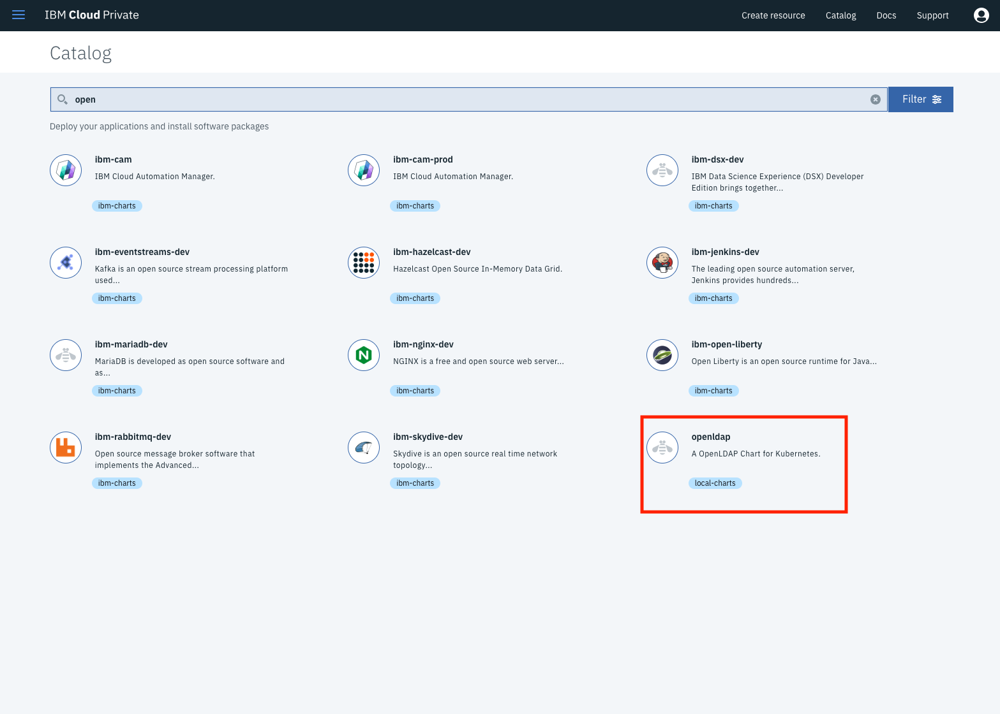


Click on **openldap** and **Configure** to see the parameters.
Add a release name **openldap** and the **default** namespace. 

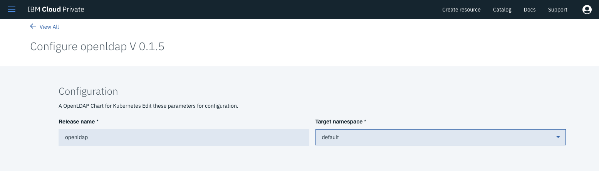

Click **Install**. Then Click **View Helm Releases**.

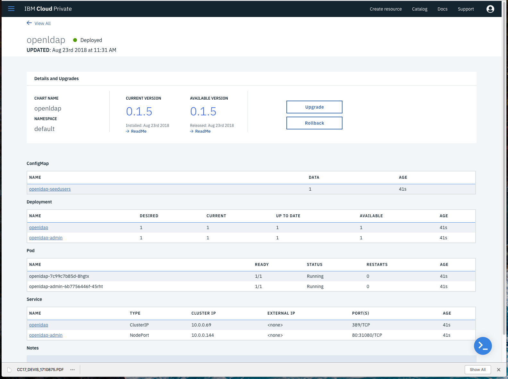

> Note : The Available Column should be 1.

Take a note of the Cluster IP for a future use:

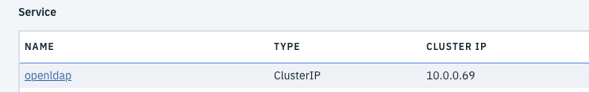

To get access to the Open LDAP portal, use the following URL:

http://icpaddress:31080

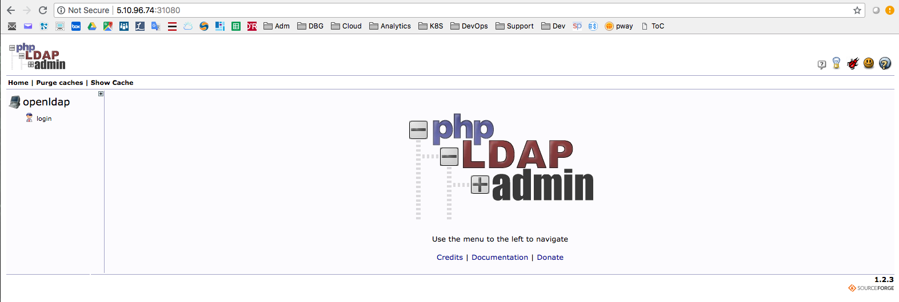

Click on Login and type the following credentials :
user:
`cn=admin,dc=local,dc=io` 
password:
`admin`

You should see the following page:

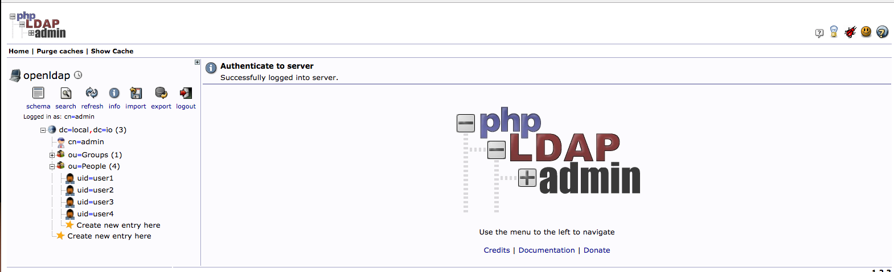

> Note : 4 users have been pre-populated.

See below the **user1**:
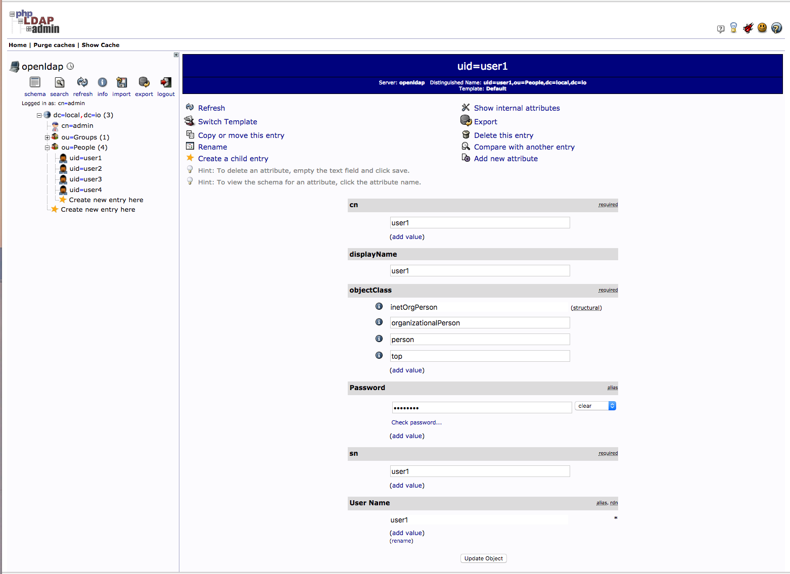


# Task3: Connect Open LDAP to ICP

Now we need to connect our newly created Open LDAP to ICP Authentication Component.
To do so, from the ICP console, Navigate to **Manage > Authentication** and click on the link:

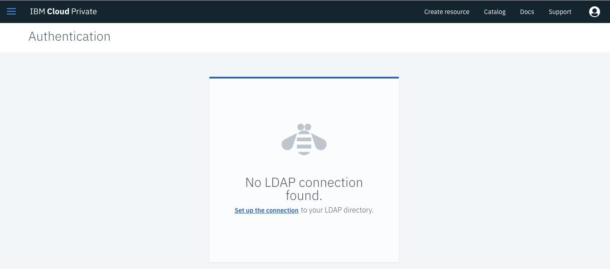

Then enter some details:

**LDAP Connection**
- Name: ldap
- Type: Custom
- URL: `ldap://clusterip:389` (use the IP address we collected in task2)

-LDAP authentication
- Base DN: `dc=local,dc=io` (default value, adjust as needed)
- Bind DN: `cn=admin,dc=local,dc=io` (default value, adjust as needed)
- Admin Password: `admin` (default value, adjust as needed)

It should look like the following screen:

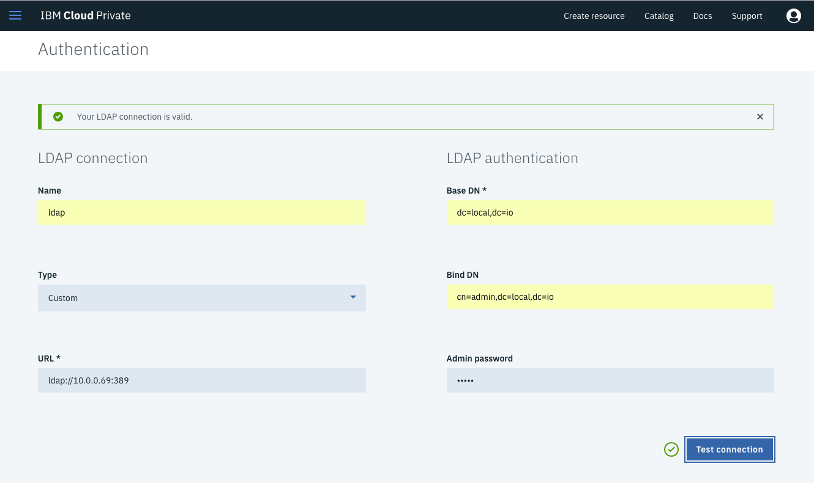

Click on Test Connection button to check the connection. You should get a green tick.

Then modify the filters:

**LDAP Filters**
- Group filter: `(&(cn=%v)(objectclass=groupOfUniqueNames))`
- User filter: `(&(uid=%v)(objectclass=person))`
- Group ID map: `*:cn`
- User ID map: `*:uid`
- Group member ID map: `groupOfUniqueNames:uniquemember`

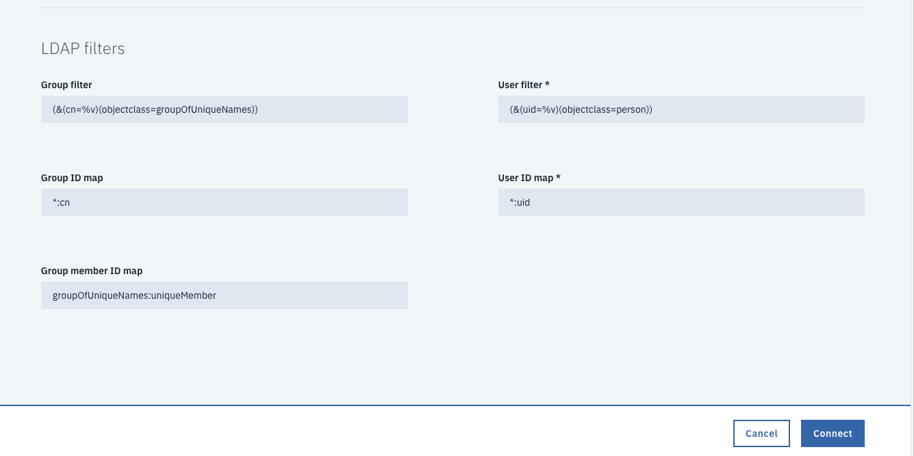

Then Click on **Connect**. If no error, then the Connect button should transform in **Edit**.

our new Open LDAP is now connected to ICP components.

# Task4: Create a Team

From the ICP console, Navigate to **Manage > Teams** and click on the link:

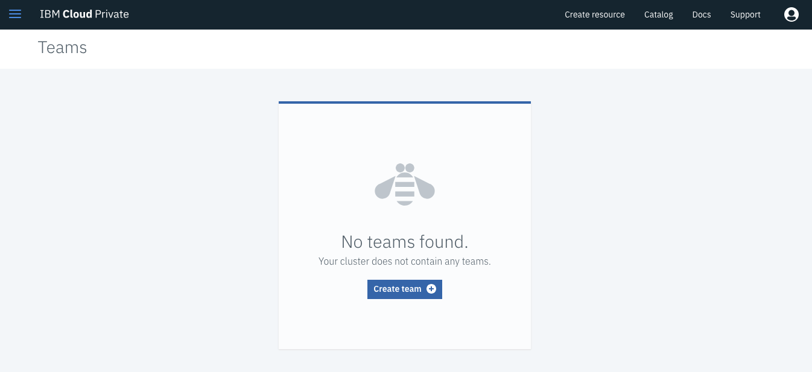

Enter a team name.
From the popup, click on the **users** button. Enter **user** in the search field. Check all 4 users to be part of the team. Then choose some **roles** as shown below.

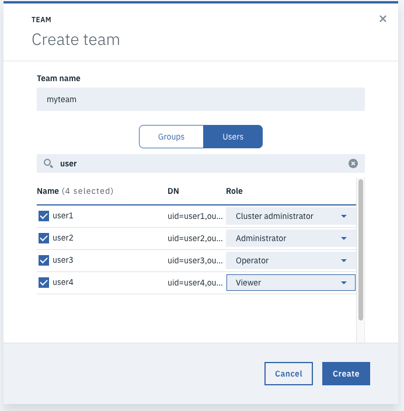

Click **Create**

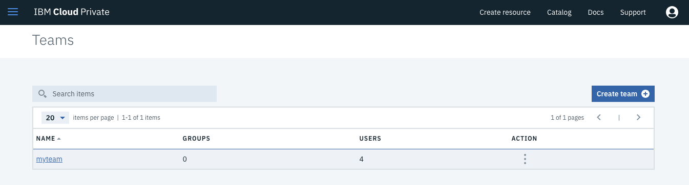

Now our team is ready to support login in ICP. 

# Task5: Check Roles

**Log out** from the ICP Console.

**Log in ** again to the ICP Console with the Cluster Admin role :
User ID : `user1`
Password : `ChangeMe`

Check some menu (we should have complete access to all menus)

**Log out** from the ICP Console.

**Log in ** again to the ICP Console with the viewer role :
User ID : `user4`
Password : `ChangeMe`

Check different menus.


# Congratulations 

You have successfully installed, deployed an OPEN LDAP and customized the ICP LDAP connection for different roles in an **IBM Cloud Private** cluster.

----


<div style="background-color:black;color:white; vertical-align: middle; text-align:center;font-size:250%; padding:10px; margin-top:100px"><b>
IBM Cloud Private - LDAP Lab
 </b></a></div>
